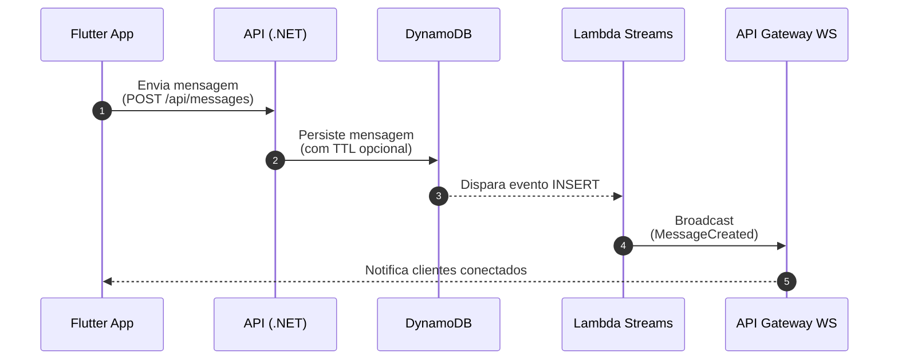
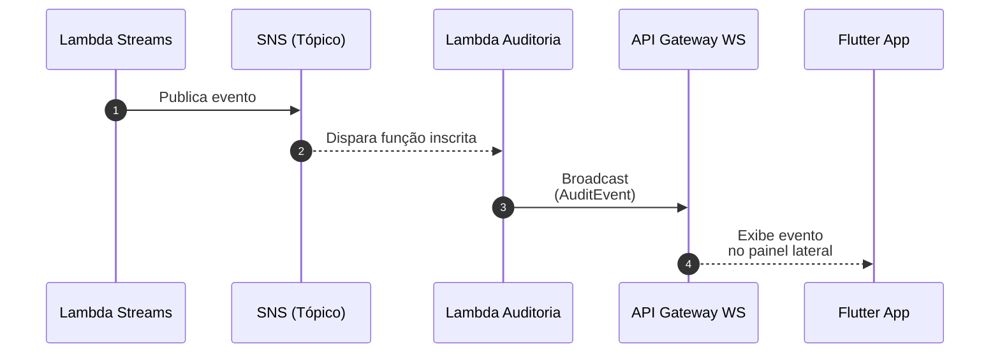
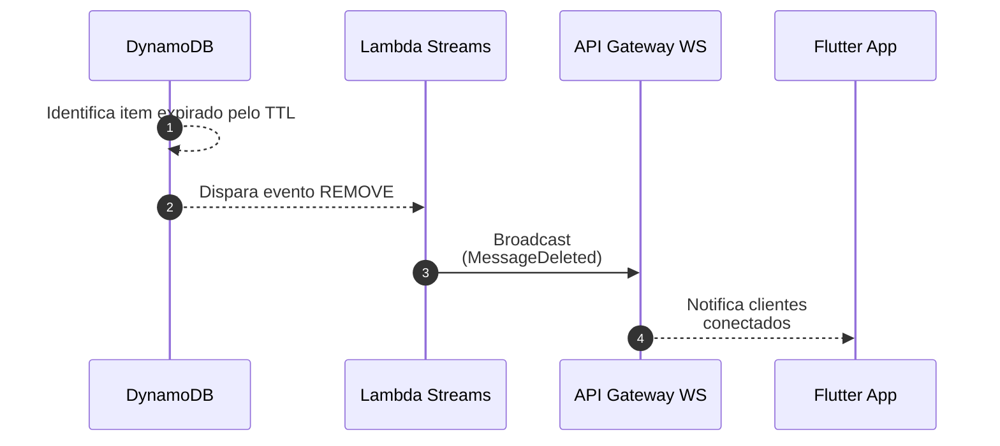

# CloudFlow

CloudFlow é um projeto de estudo de um sistema de mensagens e compartilhamento rápido em tempo real, inspirado no conceito do Opera Flow.

Construído com .NET no backend e Flutter no frontend, o projeto adota uma Arquitetura Orientada a Eventos (EDA) e serverless na AWS, utilizando DynamoDB Streams e API Gateway WebSocket para sincronização instantânea entre múltiplos dispositivos e clientes.


## Tecnologias Utilizadas

- Backend: .NET 10, AWS SDK
- Frontend: Flutter (gerenciamento de estado com Cubit / flutter_bloc)
- Cloud & Serverless (AWS):
  - AWS Lambda
  - Amazon DynamoDB & DynamoDB Streams
  - Amazon SNS
  - Amazon API Gateway (WebSocket)
  - AWS IAM


## Arquitetura e Fluxos

### 1. Envio de Mensagens em Tempo Real


### 2. Auditoria Desacoplada (Pub/Sub com SNS)


### 3. Limpeza Automática (DynamoDB TTL)



## Como Executar

### 1. Pré-requisitos
- .NET 10 SDK
- Flutter SDK
- Conta na AWS (todos os recursos utilizados são elegíveis ao Free Tier)


### 2. Configurar Variáveis de Ambiente
Copie o arquivo `.env.example` para `.env` dentro da pasta `CloudFlow` e preencha com sua região, credenciais do IAM e URLs do WebSocket:
- `AWS_WEBSOCKET_SERVICE_URL`: URL de gerenciamento (`https://{api-id}.execute-api.{region}.amazonaws.com/{stage}`)
- `AWS_WEBSOCKET_PUBLIC_URL`: URL de conexão (`wss://{api-id}.execute-api.{region}.amazonaws.com/{stage}`)

### 3. Executar o Backend (API)
```bash
cd CloudFlow
dotnet run --project CloudFlow.Api
```

### 4. Executar o Frontend (App Flutter)
```bash
cd cloud_flow_app
flutter run
```

## Configurações da AWS

### 1. IAM

#### Usuário IAM (API Local / Backend)
Crie um usuário com credenciais (`AccessKey` e `SecretKey`) e as permissões:
- `AmazonDynamoDBFullAccess`
- `AmazonAPIGatewayInvokeFullAccess`
- `AWSLambda_FullAccess`
- `AmazonS3FullAccess`

#### Roles de Execução (Lambdas)
Crie Roles do tipo AWS Service ➔ Lambda com as permissões:

1. `CloudFlow_WebSocket`
   - `AWSLambdaBasicExecutionRole`
   - `AmazonDynamoDBFullAccess`
   - `AmazonSNSFullAccess`

2. `CloudFlow_DynamoDb`
   - `AWSLambdaBasicExecutionRole`
   - `AmazonDynamoDBFullAccess`
   - `AmazonAPIGatewayInvokeFullAccess`
   - `AmazonSNSFullAccess`
   - `AmazonS3FullAccess`

3. `CloudFlow_Audit`
   - `AWSLambdaBasicExecutionRole`
   - `AmazonDynamoDBFullAccess`
   - `AmazonAPIGatewayInvokeFullAccess`
   - `AmazonSNSReadOnlyAccess`


### 2. DynamoDB
Crie as tabelas no modo On-Demand:

- `CloudFlow_Messages`
  - Partition key: `Id` (String)
  - DynamoDB Streams: Imagens novas e antigas
  - Tempo de Vida (TTL): Ativado no atributo `ExpiresAt`

- `CloudFlow_WebSocketConnections`
  - Partition key: `ConnectionId` (String)


### 3. SNS (Simple Notification Service)
Crie os tópicos para publicação e distribuição de eventos de auditoria (tipo Padrão):

- **`CloudFlow_Messages`**: eventos de ciclo de vida de mensagens
- **`CloudFlow_Users`**: eventos de presença/sessão


### 4. API Gateway (WebSocket)
Crie uma API WebSocket:
- Route selection expression: `$request.body.action`
- Rotas:
  - `$connect` ➔ Integrar com Lambda `WebSocketConnectHandler`
  - `$disconnect` ➔ Integrar com Lambda `WebSocketDisconnectHandler`
  - `$default` ➔ Mock
  - Nota: ative Integração de proxy do Lambda para as rotas Lambda
- Stage: `dev` (sempre clicar em Implantar API após alterações)


### 5. Criação e Configuração das Lambdas no Console da AWS

Crie as seguintes funções no Console da AWS:
- **Runtime**: `.NET 10`
- **Memória**: `256 MB`

#### Funções a criar:

1. **`CloudFlow_WebSocketConnect`**
   - Role de Execução: `CloudFlow_WebSocket`
   - Handler: `CloudFlow.Workers.Aws::CloudFlow.Workers.Aws.WebSocketApi.WebSocketConnectionHandler::Connect`
   - Gatilho: Rota `$connect` do API Gateway WebSocket
   - Variável de Ambiente:
     - `AWS_SNS_USERS_TOPIC_ARN`: ARN do tópico `CloudFlow_Users`

2. **`CloudFlow_WebSocketDisconnect`**
   - Role de Execução: `CloudFlow_WebSocket`
   - Handler: `CloudFlow.Workers.Aws::CloudFlow.Workers.Aws.WebSocketApi.WebSocketConnectionHandler::Disconnect`
   - Gatilho: Rota `$disconnect` do API Gateway WebSocket
   - Variável de Ambiente:
     - `AWS_SNS_USERS_TOPIC_ARN`: ARN do tópico `CloudFlow_Users`

3. **`CloudFlow_DynamoDbMessageStream`**
   - Role de Execução: `CloudFlow_DynamoDb`
   - Handler: `CloudFlow.Workers.Aws::CloudFlow.Workers.Aws.DynamoDbStreams.MessageStreamHandler::Handle`
   - Gatilho: DynamoDB apontando para a tabela `CloudFlow_Messages` (posição inicial: Latest)
   - Variáveis de Ambiente:
     - `AWS_WEBSOCKET_SERVICE_URL`: URL de gerenciamento do WebSocket
     - `AWS_SNS_MESSAGES_TOPIC_ARN`: ARN do tópico `CloudFlow_Messages`
     - `AWS_S3_BUCKET_NAME`: Nome do bucket S3 criado para anexos

4. **`CloudFlow_SnsAuditEvent`**
   - Role de Execução: `CloudFlow_Audit`
   - Handler: `CloudFlow.Workers.Aws::CloudFlow.Workers.Aws.Sns.AuditEventSnsHandler::Handle`
   - Gatilhos:
     - **SNS**: tópico `CloudFlow_Messages`
     - **SNS**: tópico `CloudFlow_Users`
   - Variável de Ambiente: `AWS_WEBSOCKET_SERVICE_URL`


### 6. Publicação do Código das Lambdas

Com as funções já criadas no Console da AWS, instale a ferramenta da AWS Lambda (caso ainda não tenha):
```bash
dotnet tool install -g Amazon.Lambda.Tools
```

Execute o script de publicação na pasta `CloudFlow` para compilar e atualizar o código de cada função:
```powershell
./deploy-lambda.ps1 CloudFlow_WebSocketConnect
./deploy-lambda.ps1 CloudFlow_WebSocketDisconnect
./deploy-lambda.ps1 CloudFlow_DynamoDbMessageStream
./deploy-lambda.ps1 CloudFlow_SnsAuditEvent
```


### 7. S3 (Simple Storage Service)
Crie um bucket de armazenamento para anexos:
- **Nome do bucket:** Ex: `cloudflow-{id-ou-usuario}`
- **Bloqueio de acesso público:** Ativado
- **Regra de Ciclo de Vida:**
  - Aba Gerenciamento ➔ Criar regra de ciclo de vida
  - Nome: `cleanup-temp-uploads`
  - Filtro por prefixo: `temp/`
  - Ação: Expirar versões atuais de objetos após **1 dia**
- **CORS:**
  - Aba Permissões ➔ Compartilhamento de recursos de origem cruzada (CORS) ➔ Editar:
  ```json
  [
      {
          "AllowedHeaders": ["*"],
          "AllowedMethods": ["GET", "PUT", "HEAD"],
          "AllowedOrigins": ["*"],
          "ExposeHeaders": []
      }
  ]
  ```


### 8. Variáveis de Ambiente Locais
Copie `CloudFlow/.env.example` para `CloudFlow/.env` e preencha as variáveis com a região, credenciais do IAM e URLs correspondentes:
- `AWS_WEBSOCKET_SERVICE_URL`: URL de gerenciamento (`https://{api-id}.execute-api.{region}.amazonaws.com/{stage}`)
- `AWS_WEBSOCKET_PUBLIC_URL`: URL de conexão (`wss://{api-id}.execute-api.{region}.amazonaws.com/{stage}`)
- `AWS_S3_BUCKET_NAME`: Nome do bucket S3 criado para anexos


## Próximos Passos

### AWS
- **Armazenamento de Arquivos:** Envio e compartilhamento de arquivos e imagens (AWS S3 com Presigned URLs)
- **Processamento Assíncrono:** Exclusão assíncrona de arquivos anexados via fila (AWS SQS)

### Azure (Planejamento de Equivalência Arquitetural)
- **Comunicação em Tempo Real:** Substituição do API Gateway WebSocket pelo **Azure Web PubSub** gerenciando conexões de clientes
- **Persistência de Dados:** Migração de dados de mensagens e conexões ativas para **Azure Cosmos DB** (API NoSQL)
- **Captura de Eventos de Dados:** Uso do **Cosmos DB Change Feed** (equivalente ao DynamoDB Streams) para reagir à inserção e alteração de mensagens
- **Processamento Serverless:** Implementação de **Azure Functions** com gatilho em Change Feed (equivalente aos handlers de Lambda) para broadcast de mensagens
- **Armazenamento de Arquivos:** Upload com URLs temporárias seguras via **Azure Blob Storage** com SAS Tokens (equivalente a S3 Presigned URLs)
- **Mensageria e Filas:** Integração de **Azure Queue Storage / Service Bus** e **Event Grid** para exclusão assíncrona e publicação de eventos
